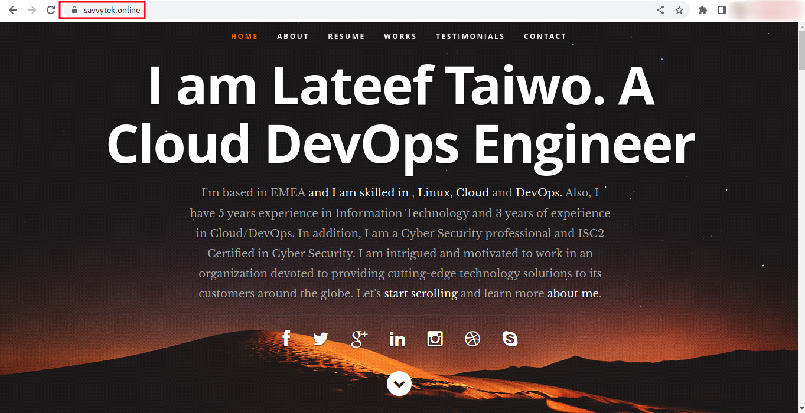

# static-websites
This repository contains two basic AWS projects. 
I used my resume website for demonstrating the two projects.
The first one hosts a static website on S3.
The second entails hosting static websites using S3, CloudFront, Route53 and ACM, these will make the website secured, have a custom domain name, fast and globally available with ultra minimal latency.

### Links to detailed articles about the projects.
1. [static website hosting using S3](https://medium.com/@taiwolateef55/how-to-host-a-static-website-on-aws-using-s3-1b595982a696)

2. [static website hosting using S3, Cloudfront, Route53 and ACM](https://medium.com/@taiwolateef55/hosting-a-static-website-on-aws-using-amazon-s3-cloudfront-route53-and-acm-ddfc755b7038)
